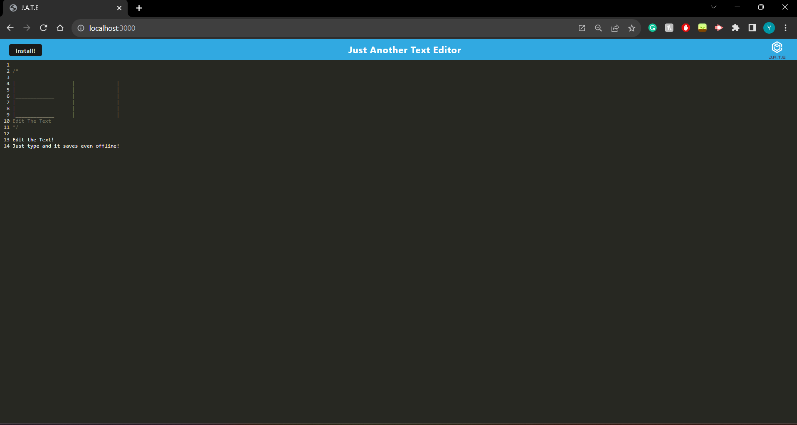
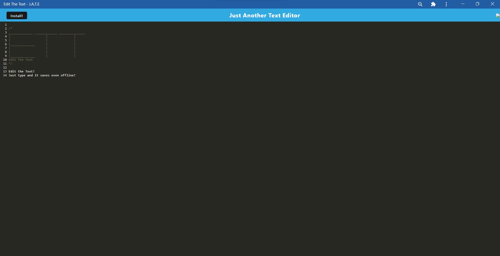

# EditTheText

This text editor was created to insert text and save it even offline. This was done as a progressive web application. We initialized this progressive web application using webpack and we registered it as a service work.

## Table of Contents
- [Installation](#installation)
- [Usage](#usage)
- [Credits](#credits)
- [License](#license)

## Installation
To install this application, please follow the instructions below:
- Clone this [repository](https://github.com/XDSirius/EditTheText)
- Once cloned, open the file
- Open a new terminal and make sure you are in the correct folder
- Run `npm install`
- After installing the necessary dependencies: run `npm start`
- Once the server has started, you are now able to use this application.

## Usage

Once the server has started, head over to your URL and type in `https://edit-the-text-76b2792c159e.herokuapp.com/`\

The application should be deployed. Go ahead and type in your desired text.\
Once you install this application on your desktop, you can now use this site to its potential.\
You can refresh the webpage and your text should remain there. \

## Credits
Credit to the University of Minnesota for providing resources, tutors, and instructors and staff for making this possible. 

## License

MIT License